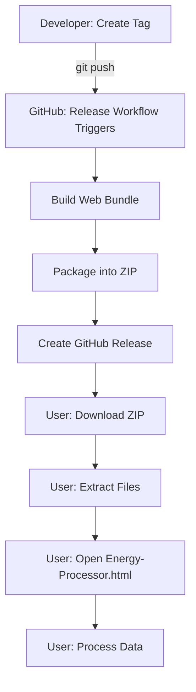

# v0.2.0 Release Creation Walkthrough

## What Was Accomplished

Created version 0.2.0 release infrastructure and updated end-user documentation for distributing the web application as a downloadable ZIP file.

---

## Release Infrastructure

### 1. GitHub Actions Release Workflow

Created [.github/workflows/release.yml](file:///Z:/never/vscode/antig/.github/workflows/release.yml):

**Trigger:** Automatically runs when version tags (v*) are pushed

**Process:**
1. Checks out code
2. Builds the web application bundle using `web/build.py`
3. Creates release package with:
   - `Energy-Processor.html` (renamed from index.html)
   - `USER_GUIDE.md`
   - `README.md`
4. Packages everything into `Energy-Processor-Web-v*.zip`
5. Creates GitHub Release with:
   - Extracted version and codename from git tag annotation
   - Generated release notes
   - Attached ZIP file

### 2. Version Tag

Created and pushed annotated tag:
```bash
git tag -a v0.2.0 -m "We Have Precisely Zero Idea What We Are Doing"
git push origin v0.2.0
```

**Codename:** "We Have Precisely Zero Idea What We Are Doing"

---

## User Guide Updates

### 3. ZIP Extraction Instructions

Updated [web/USER_GUIDE.md](file:///Z:/never/vscode/antig/web/USER_GUIDE.md) with new **Part 3: Extract and Set Up**

**What was added:**

#### Step 8: Download and Extract the ZIP File

**Windows instructions:**
- Find `Energy-Processor-Web-v*.zip`
- Right-click → "Extract All..."
- Click Extract button
- Open extracted folder

**Mac instructions:**
- Find `Energy-Processor-Web-v*.zip`
- Double-click to extract
- Open extracted folder

**Key warnings:**
- Must extract before using
- Cannot run HTML directly from inside ZIP

#### Step 9: Open the Energy Processor

- Find `Energy-Processor.html` in extracted folder
- Double-click to open in browser
- Wait 10-15 seconds for loading

### 4. Step Number Updates

Renumbered all subsequent steps:
- Step 9 → Step 10 (Paste Your Data)
- Step 10 → Step 11 (Wait for Processing)
- Step 11 → Step 12 (View Your Graph)
- Step 12 → Step 13 (Adjust Date Range)

---

## Git Commits

### Commit 1: 0f9aed6
**Message:** "Add GitHub release workflow"

**Files changed:**
- `.github/workflows/release.yml` (new)

### Commit 2: v0.2.0 Tag
**Tag annotation:** "We Have Precisely Zero Idea What We Are Doing"

### Commit 3: 50f0d07
**Message:** "Add ZIP extraction instructions to USER_GUIDE"

**Files changed:**
- `web/USER_GUIDE.md` (32 insertions, 10 deletions)

---

## Release Assets

The v0.2.0 release includes:

### Energy-Processor-Web-v0.2.0.zip
Contains:
- **Energy-Processor.html** - Bundled web application (39,998 bytes)
- **USER_GUIDE.md** - End-user instructions
- **README.md** - Project documentation

---

## How GitHub Release Works

1. **Developer pushes tag:**
   ```bash
   git tag -a v0.2.0 -m "Codename"
   git push origin v0.2.0
   ```

2. **GitHub Actions triggers:**
   - Workflow detects tag push
   - Runs build steps
   - Creates release package

3. **Release appears on GitHub:**
   - Title: "v0.2.0 - We Have Precisely Zero Idea What We Are Doing"
   - Description: Generated release notes
   - Assets: ZIP file available for download

4. **Users download:**
   - Navigate to Releases page
   - Download `Energy-Processor-Web-v0.2.0.zip`
   - Follow USER_GUIDE.md

---

## Distribution Workflow



---

## User Experience Improvements

### Before (v0.1)
- User received raw `index.html` file
- No clear instructions on where to put it
- Confusion about folder structure
- No extraction instructions

### After (v0.2)
- User downloads single ZIP file
- Clear extraction instructions (Windows/Mac)
- Renamed to `Energy-Processor.html` (more descriptive)
- Includes all necessary documentation
- Step-by-step guide from download to usage

---

## Key Learnings

1. **ZIP distribution is necessary**
   - Single HTML file too confusing without context
   - Documentation needs to travel with the application
   - Users need extraction guidance

2. **File naming matters**
   - `index.html` is generic and confusing
   - `Energy-Processor.html` is self-describing
   - Helps users identify the file months later

3. **Platform-specific instructions**
   - Windows: "Extract All..." UI
   - Mac: Auto-extraction on double-click
   - Both need explicit steps

4. **GitHub Releases automation**
   - Tag-based triggers are reliable
   - Annotated tags carry metadata (codename)
   - Release notes can be templated

---

## Future Enhancements

Potential improvements for future releases:

1. **Add screenshots to USER_GUIDE**
   - Visual guide for each step
   - Especially for ESB Networks navigation

2. **Create installer/launcher**
   - Simple executable that opens the HTML
   - Avoids browser security warnings

3. **Bundle documentation as PDF**
   - Easier to print for less tech-savvy users
   - Professional appearance

4. **Add video tutorial**
   - Screen recording of entire process
   - Published on YouTube/embedded

5. **Create Quick Start card**
   - One-page printable reference
   - Just the essential steps

---

## Verification

The release should now be available at:
`https://github.com/neveripe/antig/releases/tag/v0.2.0`

Users can:
- ✅ Download `Energy-Processor-Web-v0.2.0.zip`
- ✅ Extract files
- ✅ Follow USER_GUIDE.md
- ✅ Process their energy data offline
